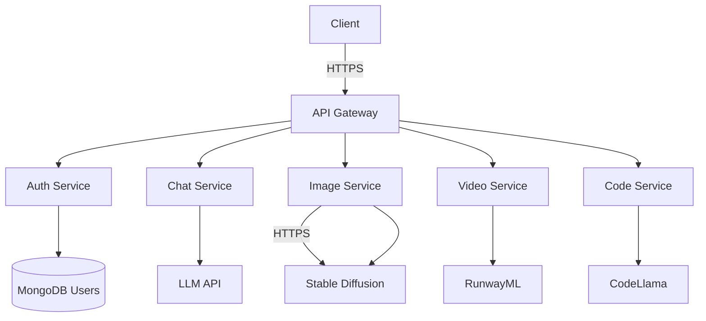
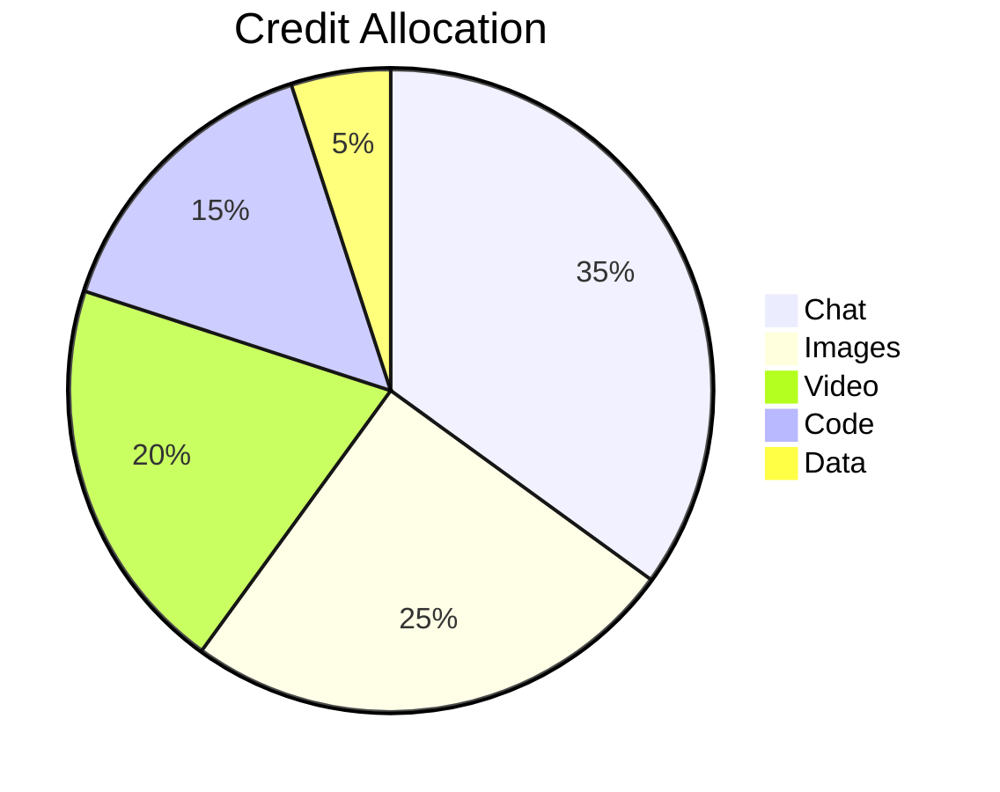
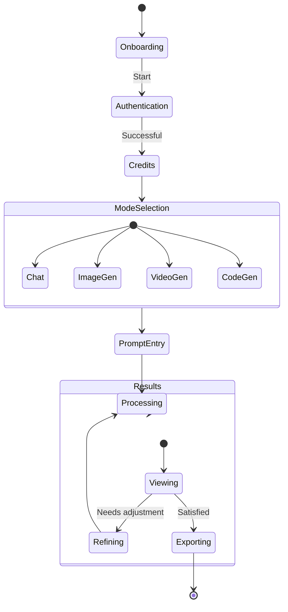

# 🚀 EndVerse AI - Next-Gen Multimodal AI Platform [](https://choosealicense.com/licenses/mit/)


The most advanced AI platform combining conversational intelligence, creative generation, and development capabilities in one unified MERN stack application.

[](https://react.dev/)
[](https://nodejs.org/)
[](https://www.mongodb.com/)

---

## 🌌 Table of Contents

- [Multimodal Capabilities](#-multimodal-capabilities)
- [Tech Stack](#-tech-stack)
- [System Architecture](#-system-architecture)
- [Installation](#-installation)
- [API Integration](#-api-integration)
- [Credit System](#-credit-system)
- [Security](#-security)
- [Screenshots](#-screenshots)
- [Roadmap](#-roadmap)
- [License](#-license)
- [Support](#-support)

---

## ✨ Multimodal Capabilities

| Feature                | Description                                                              | API Cost  |
| ---------------------- | ------------------------------------------------------------------------ | --------- |
| **💬 Smart Chat**      | Advanced conversational AI with context retention                        | 1 credit  |
| **🎨 Text-to-Image**   | Generate high-quality images from text prompts (DALL-E/Stable Diffusion) | 3 credits |
| **🎥 Text-to-Video**   | Create short video clips from textual descriptions                       | 5 credits |
| **👨‍💻 Code Generation** | Generate, debug, and explain code in multiple languages                  | 2 credits |
| **📊 Data Analysis**   | Process and visualize complex datasets                                   | 2 credits |

---

## 🛠 Tech Stack

**Frontend**

- React.js + Vite
- Tailwind CSS + ShadCN UI
- Redux Toolkit
- Three.js (for 3D model previews)

**Backend**

- Node.js + Express
- MongoDB Atlas
- Redis (for caching)
- Websockets (real-time updates)

**AI Services**

- EndVerse Core LLM
- Stable Diffusion XL (Image)
- Runway ML (Video)
- CodeLlama (Programming)

---

## 🏗 System Architecture



## 🚀 Installation

**Prerequisites**

- Node.js v18+

- MongoDB v6+

- Redis v7+

- EndVerse API Keys

```bash
# Clone repository
git clone https://github.com/201Harsh/EndVerse-AI.git
cd Backend

# Install dependencies
npm install

# Configure environment
cp .env.example .env
# Edit .env with your API keys

# Start development servers
node server.js
```

##🔌 API Integration Examples

- Text-to-Image Generation

```javascript
app.post("/api/generate-image", async (req, res) => {
  const { prompt, style } = req.body;

  const response = await axios.post("https://api.endverse.ai/v1/images", {
    prompt,
    style,
    apiKey: process.env.ENDVERSE_IMAGE_KEY,
  });

  res.json({
    imageUrl: response.data.url,
    creditsUsed: 3,
  });
});
```

- Code Generation

```javascript
app.post("/api/generate-code", async (req, res) => {
  const { prompt, language } = req.body;

  const response = await axios.post("https://api.endverse.ai/v1/code", {
    prompt,
    language,
    apiKey: process.env.ENDVERSE_CODE_KEY,
  });

  res.json({
    code: response.data.code,
    explanation: response.data.explanation,
    creditsUsed: 2,
  });
});
```

## 💰 Credit System



- New users receive 50 free credits

- Subscription plans available

- Enterprise API access

---

## 🛡 Security Features

- End-to-end encryption for sensitive data

- JWT authentication with refresh tokens

- Rate limiting (100 requests/minute)

- Prompt sanitization against injection

- GDPR compliance tools

---

## 📈 Roadmap

#### Q3 2024

- Audio generation capabilities

- Custom AI model fine-tuning

- Team collaboration features

#### Q4 2024

- Browser extension integration

- API marketplace

- AI agent workflows

---

# 📃 License

[](https://choosealicense.com/licenses/mit/)

```text
MIT License

Copyright (c) 2025 Harsh (@201Harsh)

Permission is hereby granted, free of charge, to any person obtaining a copy
of this software and associated documentation files (the “Software”), to deal
in the Software without restriction, including without limitation the rights
to use, copy, modify, merge, publish, distribute, sublicense, and/or sell
copies of the Software, and to permit persons to whom the Software is
furnished to do so, subject to the following conditions:

The above copyright notice and this permission notice shall be included in
all copies or substantial portions of the Software.

THE SOFTWARE IS PROVIDED “AS IS”, WITHOUT WARRANTY OF ANY KIND, EXPRESS OR
IMPLIED, INCLUDING BUT NOT LIMITED TO THE WARRANTIES OF MERCHANTABILITY,
FITNESS FOR A PARTICULAR PURPOSE AND NONINFRINGEMENT. IN NO EVENT SHALL THE
AUTHORS OR COPYRIGHT HOLDERS BE LIABLE FOR ANY CLAIM, DAMAGES, OR OTHER
LIABILITY, WHETHER IN AN ACTION OF CONTRACT, TORT OR OTHERWISE, ARISING FROM,
OUT OF OR IN CONNECTION WITH THE SOFTWARE OR THE USE OR OTHER DEALINGS IN THE
SOFTWARE.
```

## 🤝 Contact

- GitHub: https://github.com/201Harsh

- Email: support@endverse.ai

- Website: https://endverse.ai

- Instagram: https://www.instagram.com/201harshs/

---

## 🚀 Getting Started Guide

- Sign up for an account

- Choose your modality (chat/image/video/code)

- Enter your prompt

- Generate and refine

- Export your creations



## 🤝 Contributing

- Fork the Project

- Create your Feature Branch (git checkout -b feature/AmazingFeature)

- Commit your Changes (git commit -m 'Add some AmazingFeature')

- Push to the Branch (git push origin feature/AmazingFeature)

- Open a Pull Request

---

## Live Preview

- see the site live at
  *https://emoaichatbot.onrender.com/*

---

## 📮 Contact & Support

- Lead Developer: Harsh (@201Harsh)
- GitHub : [201Harsh](https://github.com/201Harsh) | Instagram : [201harshs](https://www.instagram.com/201harshs/)

- Support Portal: support@endgamingai2@gmail.com

---

## Made With ❤️ by Harsh
